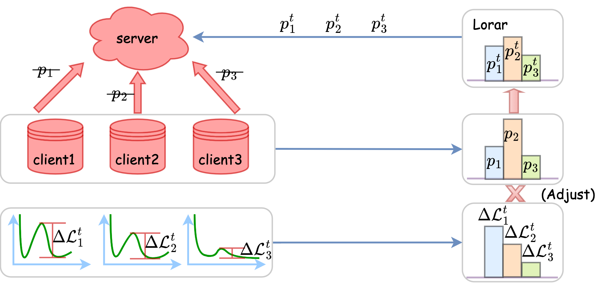

# Lorar
Code and datasets for the ACL'23 long paper "[Federated Learning for Semantic Parsing: Task Formulation, Evaluation Setup, New Algorithms](https://arxiv.org/abs/2305.17221)"

Please kindly cite the paper if you use the code or any resources in this repo:

```bib
@inproceedings{zhang2023federated,
      title={Federated Learning for Semantic Parsing: Task Formulation, Evaluation Setup, New Algorithms}, 
      author={Tianshu Zhang and Changchang Liu and Wei-Han Lee and Yu Su and Huan Sun},
      booktitle={Proceedings of the 61th Annual Meeting of the Association for Computational Linguistics},
      year={2023},
}
```

Release progress:
- :ballot_box_with_check: Dataset for FL training and evaluation (completed)
- :ballot_box_with_check: Code for FL training and evaluation (completed)
- :ballot_box_with_check: Dataset for Fine-tuning and Centralized training and evaluation (completed)
- :ballot_box_with_check: Code for Fine-tuning and Centralized training and evaluation (completed)
<!-- - :white_large_square: Code for Fine-tuning and Centralized training (TODO) -->

The figure below is the overall structure of Lorar.


## Dataset
We release our dataset (both for training and evaluation) for three training paradigms (finetune, centralized training, FL):"[data_release.zip](https://buckeyemailosu-my.sharepoint.com/:u:/r/personal/zhang_11535_buckeyemail_osu_edu/Documents/ACL23_FL4SemanticParsing/data_release.zip?csf=1&web=1&e=RYGvFF)".
Download the data and upzip the folder. Put the data folder to the path as `/Lorar/text2sql/data_release/`.


## Installation
After `git clone` this repository, please run the following command to install our dependencies.

```bash
cd Lorar/text2sql
conda env create -f Lorar.yaml
conda activate Lorar
sudo apt install libopenmpi-dev
conda install mpi4py
pip install -r Lorar_requirements.txt
```

### WandB setup

Setup [WandB](https://wandb.ai/) for logging (registration needed):
``````shell
export WANDB_API_KEY=YOUR_WANDB_API_KEY
export WANDB_PROJECT=YOUR_PROJECT_NAME
export WANDB_ENTITY=YOUR_TEAM_NAME
``````


## Code Structure of Lorar

TODO


## How to run the examples

We provide 4 different weighting mechanisms for three FL algorithms: FedOPT, FedAvg and FedProx. We provide examples for fedOPT and its four weighting mechanisms and also provide steps on how to run them below. We have provided scripts for FedAvg and FedProx as well.

For each of these make sure the datapaths and the gpu config paths are given correctly in the `fedXXX_8clients.yaml` file and also make sure the number of clients per round and number of workers match

**FedOPT**

<!-- Read `data/README.md` for more details of datasets available (TODO) -->

Adjust the hyperparameters in `text2sql/config/fedopt_8clients.yaml` and make sure data file paths are correct. More specifically, set the `data_file_path` as `/Lorar/text2sql/data_release/FL_data/question_split_full_michigan_data_w_dev_revise_table_schema.h5`, and set the `data_partition_file_path` as `/Lorar/text2sql/data_release/FL_data/michigan_question_split_full_partition_index_w_dev_revise_table_schema.h5`.

In this file, set `weighting_mechanism` as `original` for FedOPT, `loss_reduction_only` for FedOPT_lr (only loss reduction based weight, no training size control), `equal` for FedOPT_equal (all clients have the equal weight during the global model update), `lorar` for FedOPT_lorar (our proposed re-weighting mechanism).

To run FedOPT using MPI simulator on 8 clients follow the following steps:


```bash
1. cd text2sql/
2. bash run_fedopt_8clients.sh 8
```

**Finetuning**

Take GeoQuery as an example:

Before run the scripts below, first change the data path in `text2sql/third_party_UnifiedSKG/train.py`. More specifically, set two `cache_root` as `/Lorar/text2sql/data_release/finetune_centralized_data/cache`; set `table_dict_path` as `/Lorar/text2sql/data_release/finetune_centralized_data/table_dict.json`.

Train
```bash
1. cd text2sql/third_party_UnifiedSKG/
2. python train.py --seed 2002 --cfg Salesforce/T5_base_finetune_geoquery_with_cell_value.cfg --run_name T5_base_finetune_geoquery --logging_strategy steps --logging_first_step true --logging_steps 4 --evaluation_strategy steps --eval_steps 8 --metric_for_best_model eval_META_TUNING/geoquery_with_cell.cfg/exact_string_match --greater_is_better true --save_strategy steps --save_steps 8 --save_total_limit 2 --load_best_model_at_end --gradient_accumulation_steps 8 --num_train_epochs 100 --adafactor true --learning_rate 1e-4 --do_train --do_eval --do_predict --predict_with_generate --output_dir  ./output --overwrite_output_dir --per_device_train_batch_size 8 --per_device_eval_batch_size 128 --generation_num_beams 1 --generation_max_length 512 --input_max_length 1024 --ddp_find_unused_parameters false
```

Inference
```bash
1. cd text2sql/third_party_UnifiedSKG/
2. python train.py --seed 2002 --cfg Salesforce/T5_base_finetune_geoquery_with_cell_value.cfg --run_name T5_base_finetune_geoquery_inference --logging_strategy steps --logging_first_step true --logging_steps 4 --evaluation_strategy steps --eval_steps 8 --metric_for_best_model eval_META_TUNING/geoquery_with_cell.cfg/exact_string_match --greater_is_better true --save_strategy steps --save_steps 8 --save_total_limit 2 --load_best_model_at_end --gradient_accumulation_steps 8 --num_train_epochs 0.0001 --adafactor true --learning_rate 1e-4 --do_train false --do_eval false --do_predict --predict_with_generate --output_dir  ./output --overwrite_output_dir --per_device_train_batch_size 8 --per_device_eval_batch_size 128 --generation_num_beams 1 --generation_max_length 512 --input_max_length 1024 --ddp_find_unused_parameters false --load_weights_from /home/zhang.11535/Lorar/text2sql/output/third_party_UnifiedSKG/T5_base_finetune_geoquery
```

**Centralized Training**

Before run the scripts below, first change the data path in `text2sql/third_party_UnifiedSKG/train_centralized_test_predictions_question_split.py`. More specifically, set two `cache_root` as `/Lorar/text2sql/data_release/finetune_centralized_data/cache`; set `table_dict_path` as `/Lorar/text2sql/data_release/finetune_centralized_data/table_dict.json`.

Train
```bash
1. cd text2sql/third_party_UnifiedSKG/
2. python train_centralized_test_predictions_question_split.py --seed 1002 --cfg Salesforce/T5_base_finetune_centralized_with_cell_value_question_mix_eval.cfg --run_name T5_base_finetune_centralized --logging_strategy steps --logging_first_step true --logging_steps 4 --evaluation_strategy steps --eval_steps 400 --metric_for_best_model eval_META_TUNING/centralized_with_cell.cfg/exact_string_match --greater_is_better true --save_strategy steps --save_steps 400 --save_total_limit 2 --load_best_model_at_end --gradient_accumulation_steps 8 --num_train_epochs 200 --adafactor true --learning_rate 1e-4 --do_train --do_eval --do_predict --predict_with_generate --output_dir ./output --overwrite_output_dir --per_device_train_batch_size 8 --per_device_eval_batch_size 16 --generation_num_beams 1 --generation_max_length 512 --input_max_length 1024 --ddp_find_unused_parameters false
```

Inference
```bash
1. cd text2sql/third_party_UnifiedSKG/
2. python train_centralized_test_predictions_question_split.py --seed 1002 --cfg Salesforce/T5_base_finetune_centralized_with_cell_value_question_mix_eval.cfg --run_name T5_base_finetune_centralized_inference --logging_strategy steps --logging_first_step true --logging_steps 4 --evaluation_strategy steps --eval_steps 1 --metric_for_best_model eval_META_TUNING/centralized_with_cell.cfg/exact_string_match --greater_is_better true --save_strategy steps --save_steps 1 --save_total_limit 2 --load_best_model_at_end --gradient_accumulation_steps 8 --num_train_epochs 0.0002 --adafactor true --learning_rate 1e-4 --do_train false --do_eval false --do_predict --predict_with_generate --output_dir ./output --overwrite_output_dir --per_device_train_batch_size 16 --per_device_eval_batch_size 128 --generation_num_beams 1 --generation_max_length 512 --input_max_length 1024 --ddp_find_unused_parameters false --load_weights_from /home/zhang.11535/Lorar/text2sql/third_party_UnifiedSKG/output/T5_base_finetune_centralized
```

## Misc

Our codebase is adapted from UnifiedSKG, FedML, FedNLP and Picard. We will keep maintaining and cleaning our code. 
If you have any questions, please feel free to contact zhang.11535[AT]buckeyemail[DOT]osu[DOT]edu or open an issue so we can help you better and quicker :)
